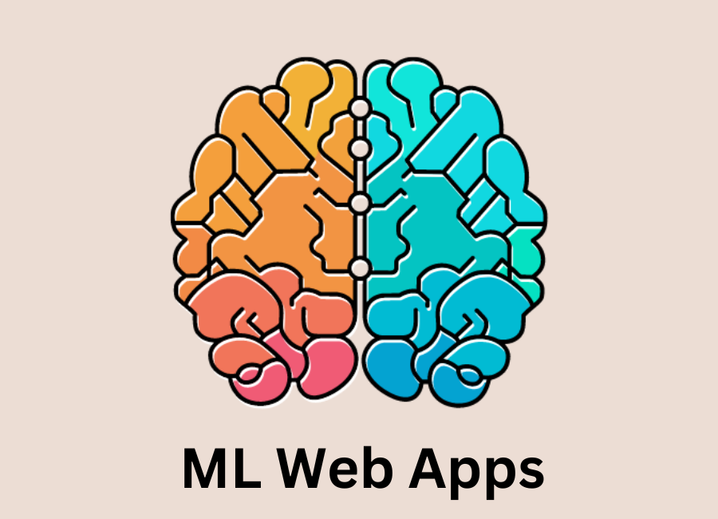
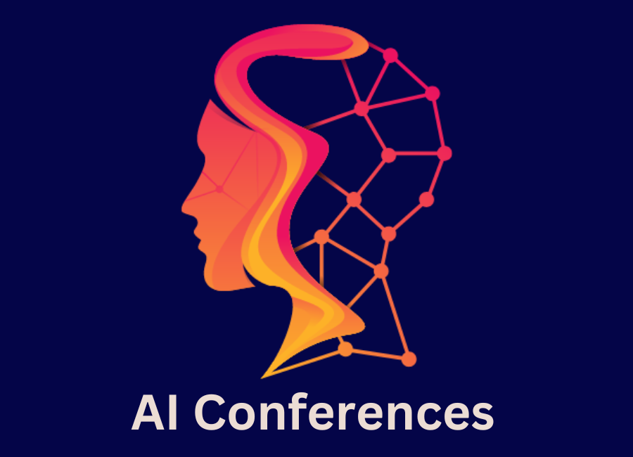

<strong> I am embarking on a captivating adventure to create impactful machine learning models that address real-life challenges. This page serves as a milestone in my journey, where I intend to divulge comprehensive insights into my YouTube videos and coding exercises.</strong>

Please click below icons to find more about the Web-apps, Tutorials, and Incoming Conferences:



----------------------

# AI Courses:
## Introduction to AI and Deep Learning. click here(https://mlshots.live/Deep-Learning-Course/)() 
## Advance Course on Deep Learning. [coming soon]()

