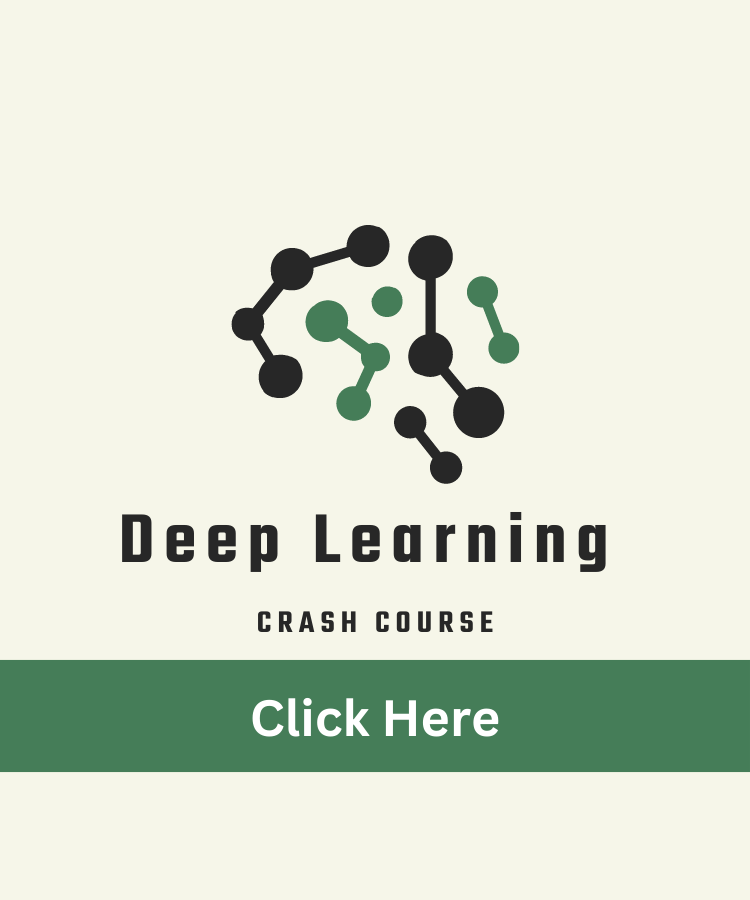

#### Welcome to this page, I am on a journey to make meaningful machine learning models to solve real life problems. This page is part of my journey, I will share all the details of my youtube videos and coding exercises. Here is our first course: 

## Deep Learning Crash Course: 
This course will give you an outline of python and deeplearning. This course goes through some of the key concepts of deep learning in detail. please click below to check the course further. 

<iframe width="420" height="315"
src="https://www.youtube.com/embed/tgbNymZ7vqY?playlist=tgbNymZ7vqY&loop=1">
</iframe>

